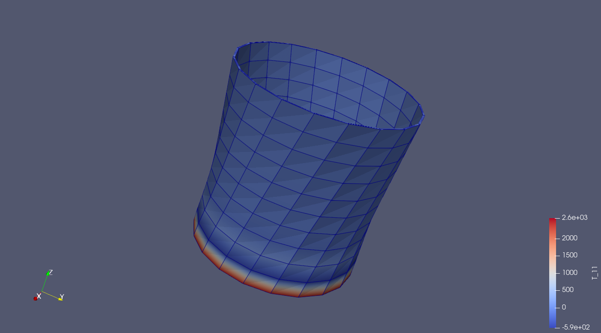

# Inifinitesimal strain classical plasticity model (Von-Mises & Tresca)
Built in deal.II v9.6.0. Capable of simulating the Von-Mises and Tresca yield criteria with linear isotropic hardening or perfect plasticity. 
The small strain assumption was made. 
The algorithms and theoretical background can be found in: 
de Souza Neto, E.A., Peric, D. and Owen, D.R., 2011. Computational methods for plasticity: theory and applications. John Wiley & Sons.

Three test cases are provided which can be driven by Dirichlet or Neumann boundary conditions:
- 1D tensile test
- plane shear
- tension and torsion of a hollow cylinder

